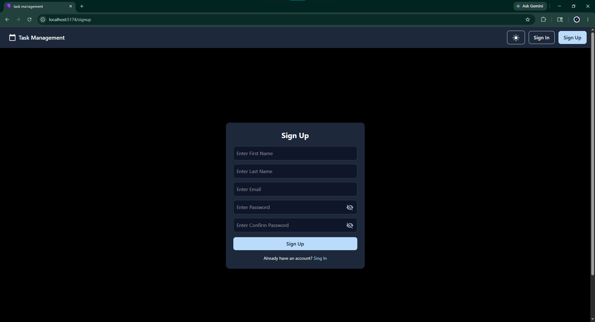
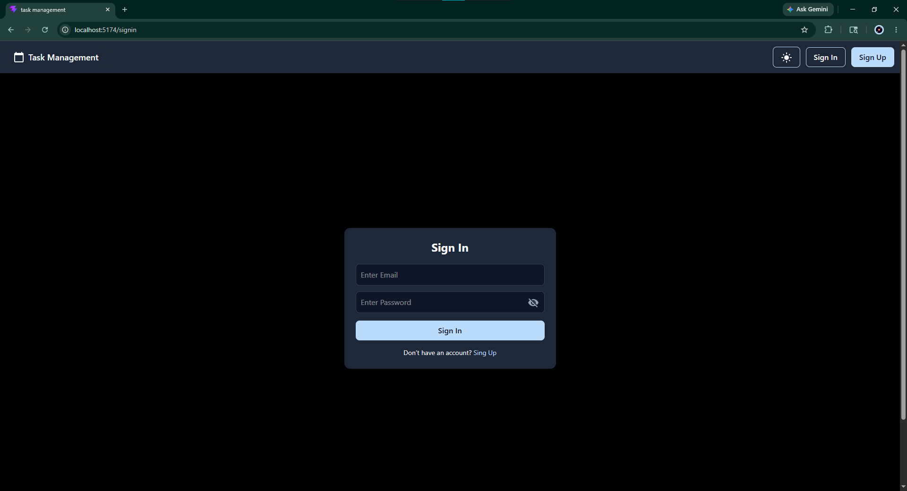
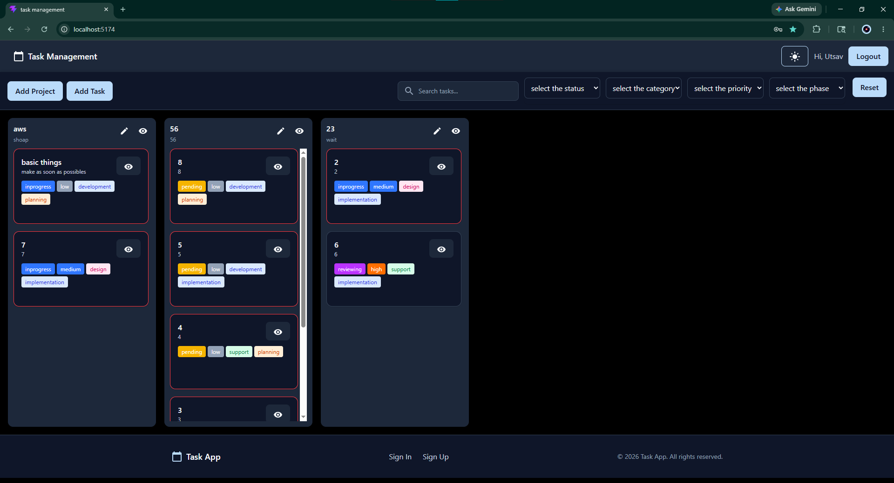
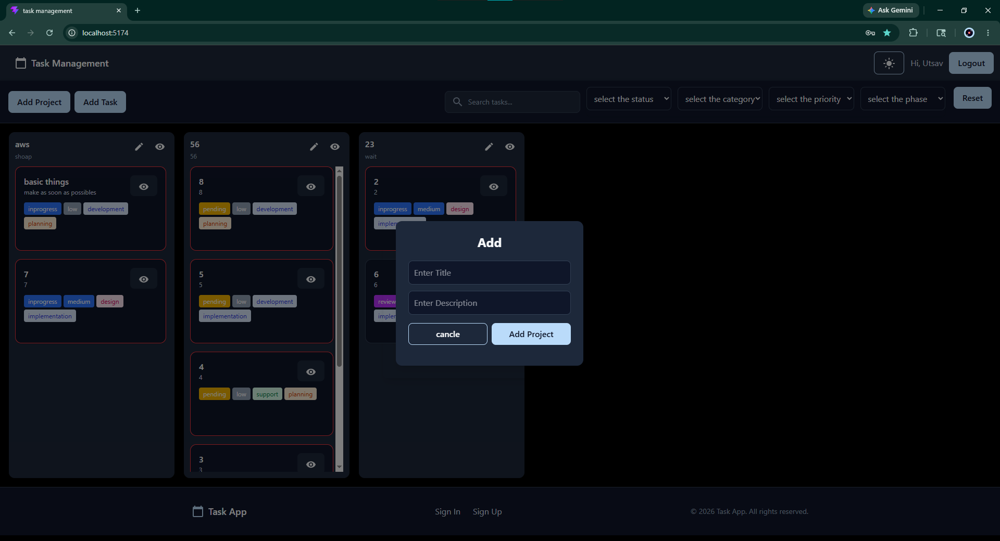
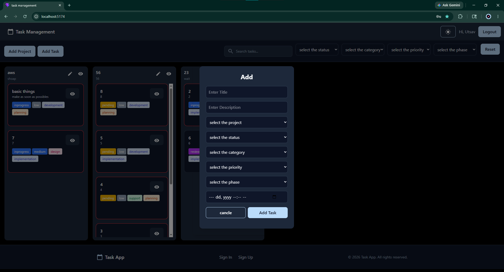
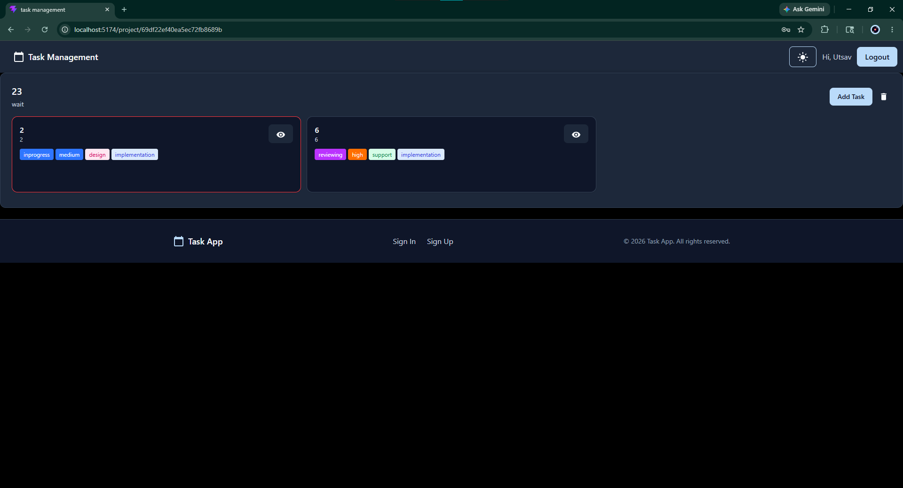
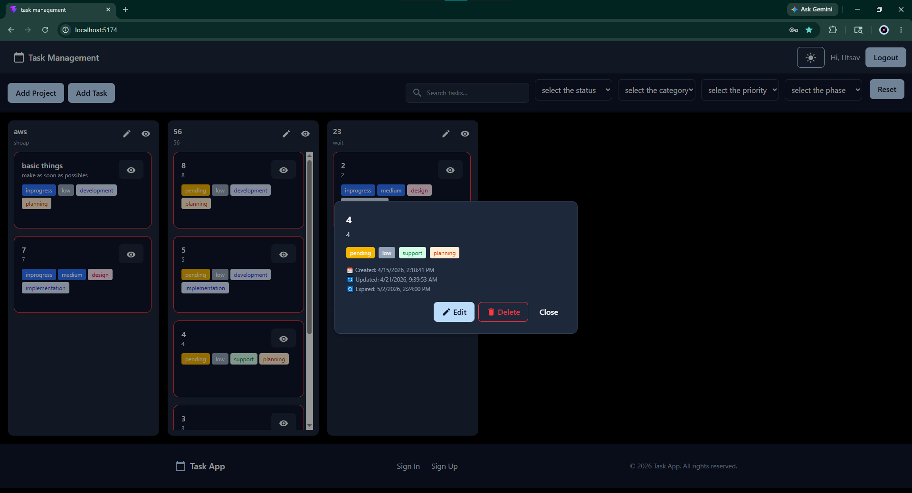

# Task Management App — MERN Version

# 📋 Task Management App — MERN Version

A modern and responsive **Task Management Application** built using the **MERN Stack** (MongoDB, Express.js, React.js, Node.js).

This application helps users manage projects and tasks efficiently with authentication, project organization, drag-and-drop task handling, and a clean UI experience.

---

# 🚀 Features

- 🔐 User Authentication (Signup / Signin)
- 📁 Create & Manage Projects
- ✅ Add, Update & Delete Tasks
- 🧩 Drag & Drop Task Management
- 🎨 Modern UI using Material UI + Tailwind CSS
- ⚡ Fast Frontend powered by Vite
- 🍪 JWT Authentication with Refresh Tokens
- 📱 Responsive Design

---

# 🛠️ Tech Stack

## Frontend

- React.js
- Vite
- Redux
- React Router DOM
- Material UI
- Tailwind CSS
- Axios
- React Toastify
- DnD Kit

## Backend

- Node.js
- Express.js
- MongoDB
- Mongoose
- JWT Authentication
- bcryptjs
- Cookie Parser
- CORS

---

# 📂 Project Structure

```bash
task-management-app/
│
├── backend/
│
├── frontend/
│
├── dbSchema/
│
└── screenshots/
    └── mern_version/

```

---

# 📸 Screenshots

## 🔐 Signup Page



---

## 🔑 Signin Page



---

## 🏠 Home Screen



---

## 📁 Added Project



---

## ✅ Added Task



---

## 👀 Project View



---

## 📋 Task View



---

# ⚙️ Environment Variables

## Frontend `.env`

Create a `.env` file inside the `frontend` folder and add:

```env
VITE_SERVER_URL=http://localhost:5000/api
```

---

## Backend `.env`

Create a `.env` file inside the `backend` folder and add:

```env
CONNECTION_URL=mongodb://localhost:27017/task_mangent

FRONTEND_URL=http://localhost:5174

PORT=5000

JWT_SECRET=ACCESS_TOKEN_SECRET

REFRESH_TOKEN_SECRET=REFRESH_TOKEN_SECRET

BCRYPT=12

NODE_ENV=production
```

---

# 📦 Backend Dependencies

```json
{
  "bcryptjs": "^3.0.3",
  "body": "^5.1.0",
  "cookie-parser": "^1.4.7",
  "cors": "^2.8.6",
  "dotenv": "^17.4.1",
  "express": "^5.2.1",
  "jsonwebtoken": "^9.0.3",
  "mongoose": "^9.4.1"
}
```

---

# 📦 Frontend Dependencies

```json
{
  "@dnd-kit/core": "^6.3.1",
  "@dnd-kit/react": "^0.3.2",
  "@dnd-kit/sortable": "^10.0.0",
  "@dnd-kit/utilities": "^3.2.2",
  "@emotion/react": "^11.14.0",
  "@emotion/styled": "^11.14.1",
  "@mui/icons-material": "^7.3.9",
  "@mui/material": "^7.3.9",
  "@tailwindcss/vite": "^4.2.2",
  "axios": "^1.14.0",
  "dotenv": "^17.4.1",
  "react": "^19.2.4",
  "react-dom": "^19.2.4",
  "react-redux": "^9.2.0",
  "react-router-dom": "^7.14.0",
  "react-toastify": "^11.0.5",
  "redux": "^5.0.1",
  "redux-thunk": "^3.1.0",
  "tailwindcss": "^4.2.2"
}
```

---

# 🧑‍💻 Installation & Setup

## 1️⃣ Clone the Repository

```bash
git clone https://github.com/your-username/task-management-app.git
```

---

## 2️⃣ Navigate into the Project

```bash
cd task-management-app
```

---

# 🔧 Backend Setup

## Go to backend folder

```bash
cd backend
```

## Install dependencies

```bash
npm install
```

## Run backend server

```bash
npm run dev
```

Backend will run on:

```bash
http://localhost:5000
```

---

# 💻 Frontend Setup

## Go to frontend folder

```bash
cd frontend
```

## Install dependencies

```bash
npm install
```

## Run frontend

```bash
npm run dev
```

Frontend will run on:

```bash
http://localhost:5174
```

---

# 🍴 How to Fork This Repository

1. Open the repository on GitHub
2. Click the **Fork** button at the top-right corner
3. Wait for GitHub to create your fork
4. Clone your forked repository

```bash
git clone https://github.com/your-username/task-management-app.git
```

---

# 🤝 Contributing

Contributions are always welcome!

If you'd like to contribute:

1. Fork the repository
2. Create a new branch

```bash
git checkout -b feature-name
```

3. Commit your changes

```bash
git commit -m "Add new feature"
```

4. Push to your branch

```bash
git push origin feature-name
```

5. Create a Pull Request

---

# 📝 Scripts

## Frontend

```bash
npm run dev
npm run build
npm run preview
```

## Backend

```bash
npm run dev
npm start
```

---

# 🔒 Authentication

This project uses:

* JWT Access Tokens
* Refresh Tokens
* HTTP-only Cookies
* bcrypt password hashing

---

# 🌟 Future Improvements

* 📅 Task deadlines
* 👥 Team collaboration
* 🔔 Notifications
* 📊 Dashboard analytics
* 🌙 Dark mode
* 📱 Mobile App Version

---

# 📄 License

This project is licensed under the MIT License.

---

# 👨‍💻 Author

Developed with ❤️ using the MERN Stack.
